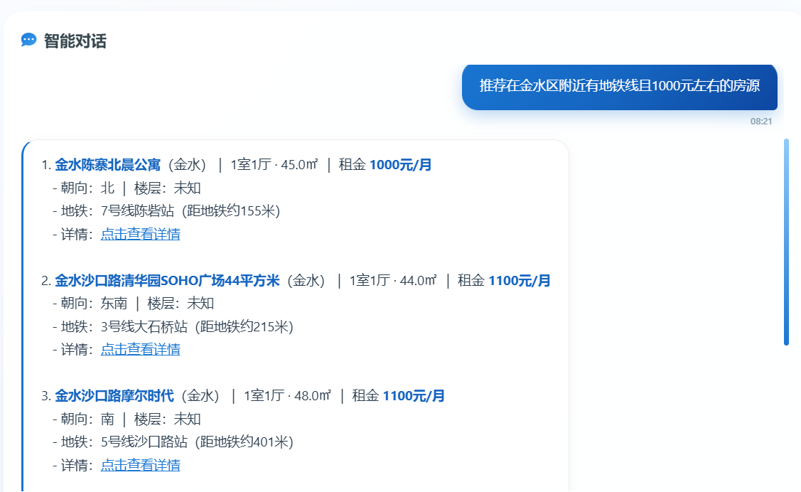
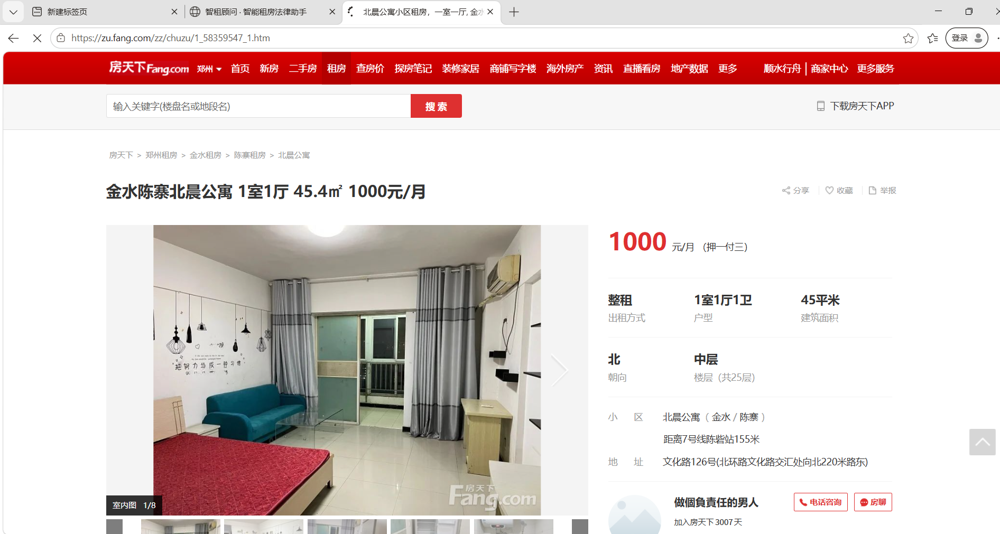
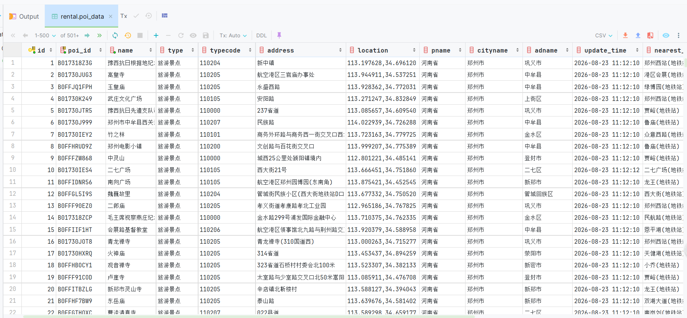
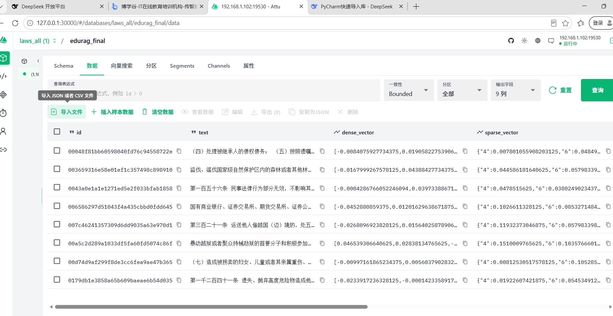
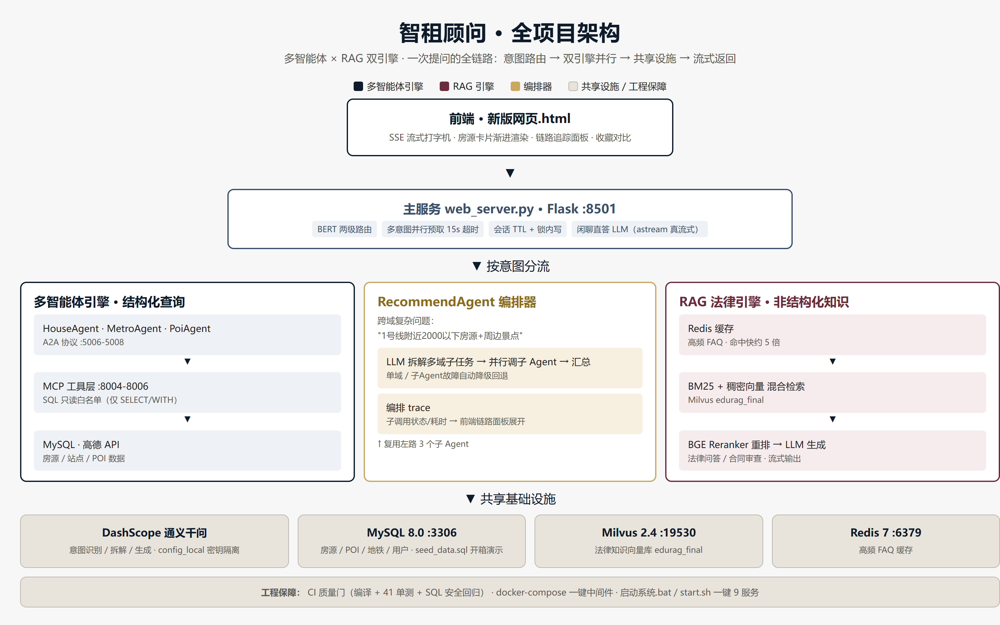
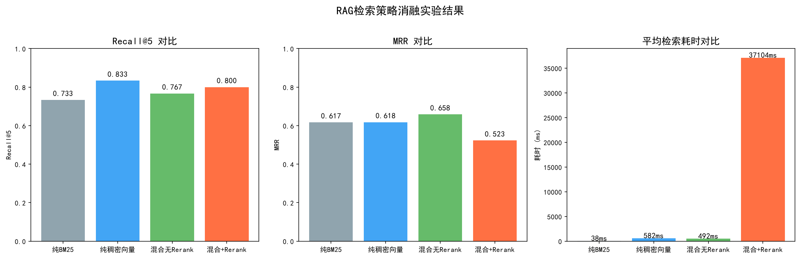
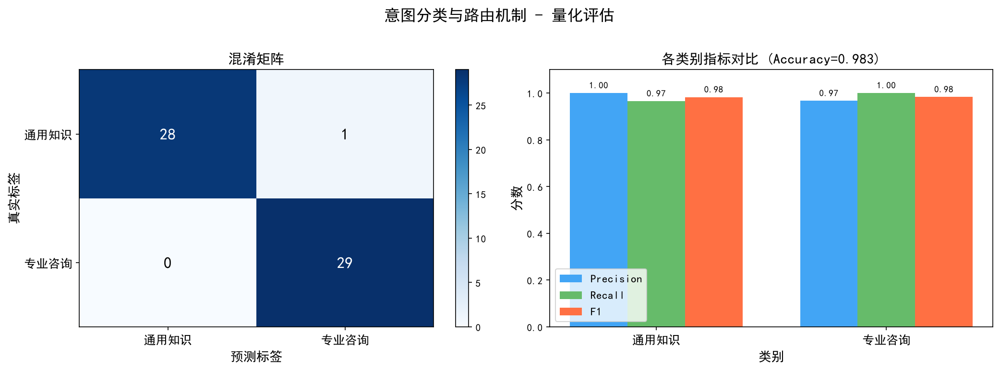

# 🏠 智租顾问 · 基于多智能体与 RAG 的智能租房咨询系统


面向郑州本地租房场景的 **多智能体协作 + 检索增强生成（RAG）** 智能问答系统：输入一句自然语言，系统自动完成 **意图识别 → 多智能体编排 → 数据库 / 知识库检索 → 流式回复**，覆盖房源查询、地铁出行、周边探索、综合推荐、法律问答与合同审查六大场景。

> **技术栈**：Python · Flask(SSE) · A2A 多智能体协议 · MCP 工具调用 · BERT 意图分类 · BM25 + BGE-M3 混合检索 · BGE Reranker · Milvus · Redis 缓存 · MySQL · 通义千问 LLM

---

## 🎬 演示视频

[](https://www.bilibili.com/video/BV1queJ6qE7f)

> 完整演示：房源查询 → 地铁 / 周边 / 综合推荐 → 合同审查 → 收藏对比 → 流式响应

---

## 📸 功能演示

**① 系统主界面**：左侧智能对话（快捷提问 / 合同审查），右侧能力中心实时显示 4 个智能体在线状态与"双引擎在线"标识


**② 房源智能推荐**：自然语言查询自动生成 SQL，返回带朝向 / 楼层 / 地铁距离的结构化房源卡片，支持一键收藏



**③ 真实数据底座**：房源数据来自房天下郑州站真实采集（整租 646 条 / 合租 83 条），POI 与地铁数据来自高德开放平台

| 房源真实数据（房天下） | POI 周边数据（MySQL） |
|:---:|:---:|
|  |  |

**④ 向量检索基础设施**：法律知识库以 BGE-M3 **稠密 + 稀疏双向量**存入 Milvus



---

## ✨ 亮眼功能

| 功能 | 亮点 |
|------|------|
| 🧠 **多智能体编排** | 4 个子智能体通过 A2A 协议互联；复杂问题（"1号线附近2000以下房源"）由 RecommendAgent 作为**编排器**：LLM 拆解子任务 → 并行调度 House / Poi / Metro → 汇总综合推荐 |
| ⚡ **意图级并行预取** | 多意图问题（"金水区房源 + 1号线 + 景点"）由 web_server 线程池**并发预取**全部子智能体，按原顺序**保序输出**，总延迟 ≈ 最慢子智能体 |
| 🔍 **RAG 混合检索** | BM25 关键词 + BGE-M3 稠密 / 稀疏双向量加权融合，再经 BGE Reranker 重排序，兼顾召回与精度（消融实验见文末） |
| 🎯 **BERT 意图分类** | 基于 `bert-base-chinese` 微调（800 条训练样本），支持多意图组合识别，租房常识关键词强制走 RAG 保引用 |
| ⚡ **SSE 流式响应** | 前端流式输出 + 房源卡片渐进式渲染，解析到一套就渲染一套，观感极佳 |
| 🔗 **智能体链路追踪** | 每次提问实时展示调用了哪些智能体、顺序、耗时；编排器的子调用展开为独立 SubAgent 节点（**多智能体可观测性**） |
| 🚀 **Redis 缓存加速** | 高频租房常识命中 Redis 直接返回，跳过完整 RAG 链路，响应快约 **5 倍** |
| ⚖️ **合同上传审查** | 支持上传租房合同（OCR / PDF / Word），基于 RAG 给出法律风险分析 |
| ⭐ **收藏对比分析** | 收藏房源后可 AI 生成多维度对比（租金性价比 / 通勤 / 周边配套） |
| 🛡️ **可靠性设计** | SQL 只读白名单 · MCP 调用超时 + 连接重试 · 子智能体故障降级回退 · 错误四层归因（success / no_data / error / connection_error） |

---

## 🏗️ 系统架构

> **双引擎架构**：结构化数据查询（房源 / 地铁 / POI）走 **A2A 多智能体 + MCP** 链路；非结构化法律知识走 **RAG 检索增强生成** 链路。两条链路由意图路由统一调度，最终经 SSE 流式返回前端。



### 一次提问的完整处理链路

```
用户提问 "1号线附近2000以下的房源"
        │
        ▼
① BERT 意图分类 ──► 命中 {recommend}（跨领域组合意图）
        │
        ▼
② RecommendAgent 编排器：LLM 拆解子任务
        │
        ├──► HouseAgent ──MCP──► MySQL house_listing（租金≤2000）
        ├──► MetroAgent ──MCP──► MySQL metro_station（1号线站点）
        └──► PoiAgent   ──MCP──► MySQL poi_data（站点周边）
        │  （asyncio 并行调用，20s 超时，全挂降级回退 text2sql）
        ▼
③ 汇总各子智能体结果 + 写入 orchestration_trace（可观测性）
        │
        ▼
④ SSE 流式返回前端（卡片渐进渲染 + 链路追踪可视化）
```

### 意图路由总览

| 意图 | 子智能体 | 数据源 | 示例 |
|------|---------|--------|------|
| `house` | HouseQueryAssistant | house_listing | 金水区2000元以下整租房 |
| `metro` | MetroQueryAssistant | metro_station | 郑州东站坐几号线 |
| `poi` | PoiQueryAssistant | poi_data | 二七广场附近美食 |
| `recommend` | RecommendQueryAssistant（多智能体编排） | 多表联合 | 1号线附近2000以下房源 |
| `legal` | LegalQASystem（RAG） | 法律知识库 + FAQ | 房东不退押金怎么办 |
| `chat` | ChatLLM（通用对话） | — | 你好 / 你是谁 |

---

## 📁 目录架构

```
多智能体+RAG综合项目/
├── Agent/                          # 主系统代码
│   ├── web_server.py               # Web 后端入口（Flask :8501，意图路由 + SSE 流式 + 并行预取）
│   ├── config.py                   # 配置（密钥读取自 config_local/，环境变量优先）
│   ├── a2a_server/                 # 多智能体协作层（A2A 协议）
│   │   ├── base_text2sql_server.py #   Text2SQL 智能体抽象基类（SQL生成 / 修正重试 / 连接重试）
│   │   ├── house_server.py         #   房源查询智能体
│   │   ├── metro_server.py         #   地铁出行智能体
│   │   ├── poi_server.py           #   周边探索智能体
│   │   └── recommend_server.py     #   综合推荐智能体（多智能体编排器）
│   ├── mcp_server/                 # 工具执行层（MCP 服务器，统一封装 SQL + 只读白名单）
│   ├── legal_qa/                   # 法律问答子系统（RAG 引擎 + BM25 + Redis 缓存 + BERT 分类）
│   ├── 数据库操作/                  # 数据采集（房天下爬虫 / 高德 POI / 地铁）
│   ├── sql/rental_schema.sql       # 数据库表结构
│   └── 启动系统.bat / start.sh     # 一键启动脚本
├── docs/                           # 文档与图件
│   ├── architecture_v3.html        # 架构图源文件
│   ├── images/                     # 架构图
│   └── screenshots/                # 功能演示截图
├── 实验脚本/                        # 实验评估（RAG 消融 + 意图分类）
├── tests/                          # 单元测试（41 个用例）
├── docker-compose.yml              # MySQL + Redis + Milvus 一键启动
└── requirements.txt                # Python 依赖清单
```

---

## 🚀 快速开始

### 环境要求

- Python 3.10+ · Docker（推荐，一键启动中间件）· 阿里云 DashScope API Key

### 1. 一键启动中间件 + 导入数据

```bash
# 启动 MySQL + Redis + Milvus
docker compose up -d

# 导入表结构与演示种子数据（52 条房源 / 15 个地铁站 / 15 个 POI）
docker exec -i zhizu-mysql mysql -uroot -pzhizu123 < Agent/sql/rental_schema.sql
docker exec -i zhizu-mysql mysql -uroot -pzhizu123 < Agent/sql/seed_data.sql
```

### 2. 配置密钥

复制仓库模板创建 `config_local/` 并填入真实密钥（已 `.gitignore`，不会提交）：

```
config_local/
├── config.ini     # MySQL / Redis / Milvus / LLM 配置
└── keys.py        # DASHSCOPE_API_KEY / MYSQL_PASSWORD / REDIS_PASSWORD
```

### 3. 安装依赖

```bash
conda create -n lang_env python=3.10 && conda activate lang_env
pip install -r requirements.txt
```

### 4. 一键启动系统

- **Windows**：双击 `Agent/启动系统.bat`（自动启动 MCP → A2A → Web）
- **Linux / macOS**：`./Agent/start.sh`

打开 **http://localhost:8501** 即可使用。

> 提示：法律问答需先构建向量库（可选步骤，不影响房源 / 地铁 / POI / 闲聊）：`python Agent/ingest_rental_laws.py`

---

## 💬 使用示例

| 用户提问 | 路由 |
|---------|------|
| 金水区有没有2000元以下的整租房？ | 🏠 HouseQueryAssistant |
| 郑州东站坐几号线？ | 🚇 MetroQueryAssistant |
| 二七广场附近有什么好吃的？ | 📍 PoiQueryAssistant |
| 1号线附近2000以下的房源有哪些？ | ⭐ RecommendQueryAssistant（多智能体编排） |
| 房东不退押金怎么办？ | ⚖️ LegalQASystem（RAG） |
| 帮我看看这份合同有什么问题 | ⚖️ LegalQASystem（合同审查） |
| 你好 / 谢谢 | 💬 ChatLLM（通用对话） |

---

## 📊 实验与评估

`实验脚本/` 包含两组可复现实验，产出论文 / 答辩所需的定量指标与图表：

### 实验一：RAG 检索策略消融实验

对比 **纯 BM25 / 纯稠密向量 / 混合检索 / 混合 + Reranker** 四种策略（Recall@5、MRR、平均耗时）：



### 实验二：BERT 意图分类评估



```bash
python 实验脚本/run_rag_ablation.py      # 消融实验
python 实验脚本/run_intent_evaluation.py # 意图分类评估
```

---

## 📄 License

本项目基于 [MIT License](LICENSE) 开源。

## 🙏 致谢

- 数据来源：房天下（房源）、高德开放平台（POI / 地铁）、法律法规公开文本
- 技术框架：LangChain · python-a2a · MCP · Milvus · Hugging Face Transformers
