# 🏠 智租顾问 · 基于多智能体协作与 Agentic RAG 的智能租房咨询系统


面向郑州本地租房场景的 **多智能体协作 + Agentic RAG** 智能问答系统：输入一句自然语言，系统自动完成 **LLM 意图路由 → A2A 多智能体编排 / Agentic RAG 反思循环 → 数据库 / 知识库检索 → SSE 流式回复**，覆盖房源查询、地铁出行、周边探索、综合推荐、法律问答与合同审查六大场景。

> **技术栈**：Python 3.10 · Flask(SSE) · A2A 多智能体协议 · MCP 工具调用 · LangChain · LLM 意图路由（通义千问 qwen-plus） · BERT 查询分类 · BM25 + BGE-M3 混合检索 · BGE Reranker · Milvus 向量库 · Redis 缓存 · MySQL

---

## 🎯 项目定位与设计动机

租房咨询是一类典型的**异构数据 + 跨域知识**问答问题，单一技术路线无法优雅解决：

| 问题 | 数据形态 | 最优技术路线 |
|------|---------|-------------|
| "金水区 2000 元以下整租房" | 结构化（MySQL 表，需精确筛选） | Text2SQL Agent（精确 SQL 而非向量模糊检索） |
| "房东不退押金怎么办" | 非结构化（法律条文，需语义匹配 + 引用） | RAG 检索增强生成（向量 + 关键词 + 重排） |
| "1号线附近 2000 以下的房子 + 周边景点" | 跨域组合（同时涉及房源/地铁/POI） | 多智能体编排（拆解子任务 → 并行调度 → 汇总） |

**核心结论：数据形态决定技术路线。** 系统采用"双引擎 + 意图路由"架构——结构化数据走 **A2A 多智能体 + MCP** 链路，非结构化法律知识走 **Agentic RAG** 链路，两条链路由 LLM 意图路由统一调度，最终经 SSE 流式返回前端。

---

## ✨ 核心亮点（技术深度速览）

| 技术点 | 深度说明 |
|------|---------|
| 🧠 **Agentic RAG 反思循环** | Self-RAG 风格：LLM 自主规划检索方案 → 工具化检索 → 生成 → 反思自检（答案是否被证据充分支持）→ 不通过则改写查询再检一轮，反思轨迹前端可视化 |
| 🔀 **A2A 多智能体编排** | RecommendAgent 作为**编排器（Orchestrator）**：LLM 拆解跨域子任务 → `asyncio.gather` 并行调度 House/Poi/Metro 子 Agent → 汇总综合推荐，子调用写入 `orchestration_trace` 实现多智能体可观测性 |
| ⚡ **意图级并行预取** | 多意图问题由 web_server 线程池**并发预取**全部子 Agent，按原顺序**保序输出**，总延迟 ≈ 最慢子智能体而非求和 |
| 🔍 **RAG 混合检索** | BM25 关键词 + BGE-M3 稠密/稀疏双向量**三路加权融合**，再经 BGE Reranker 精排，兼顾术语精确匹配与语义变体理解（有消融实验数据） |
| 🎯 **两级意图路由** | 入口用 **LLM 意图识别**（6 类多意图组合 + 子查询改写）；RAG 内部用 **BERT 微调分类器**（98.28% 准确率）区分"通用知识/专业咨询"，高频场景零成本分流 |
| 🛡️ **可靠性设计** | SQL 只读白名单 · 错误四层归因（success/no_data/error/connection_error）· SQL 修正重试 / 空结果放宽重查 / 连接重试 · 子 Agent 故障降级回退 · 数量词强制 LIMIT 兜底 |
| 🚀 **Redis 多层缓存** | 高频租房常识命中缓存直接返回（**1.1s** vs 完整 RAG 链路 **23.3s**，快约 5 倍）；BM25 语料、RAG 答案均缓存 |
| 📈 **SSE 流式 + 链路追踪** | 前端 token 流式输出 + 房源卡片渐进渲染；每次提问实时展示调用了哪些智能体、顺序、耗时，编排子调用展开为独立 SubAgent 节点 |

---

## 🏗️ 系统架构

> **双引擎架构**：结构化数据查询（房源 / 地铁 / POI）走 **A2A 多智能体 + MCP** 链路；非结构化法律知识走 **Agentic RAG** 链路。两条链路由 LLM 意图路由统一调度，最终经 SSE 流式返回前端。


### 核心机制详解

**① Agentic RAG 反思循环（Self-RAG）**：与"检索一次就生成"的朴素 RAG 不同，系统让 LLM 参与检索决策全流程：

```
用户问题
  │
  ▼
① 检索规划：LLM 自主决定检索词与策略（直接检索 / 假设问题检索 / 子查询检索 / 回溯检索）
  │
  ▼
② 工具化检索：按规划逐词检索 → BM25 + 稠密/稀疏向量三路融合 → Reranker 精排 → 去重
  │
  ▼
③ LLM 生成答案（带引用条文）
  │
  ▼
④ 反思自检：LLM 判断"答案是否被检索证据充分支持" + 缺失证据分析
  │
  ├─ 支持 → 输出最终答案（反思轨迹：第N轮检索X篇·supported=true）
  │
  └─ 不支持 → ⑤ 改写检索词 → 回到 ② 再检一轮（最多 2 轮）
```

反思轨迹（`last_agentic_trace`）记录每一轮的检索词、文档数、支持判定与缺失证据，供前端链路面板展示与调试——**可观测的 Agentic RAG**。

**② 多智能体编排（A2A Orchestrator）**：跨域复杂问题由 RecommendAgent 编排器处理：

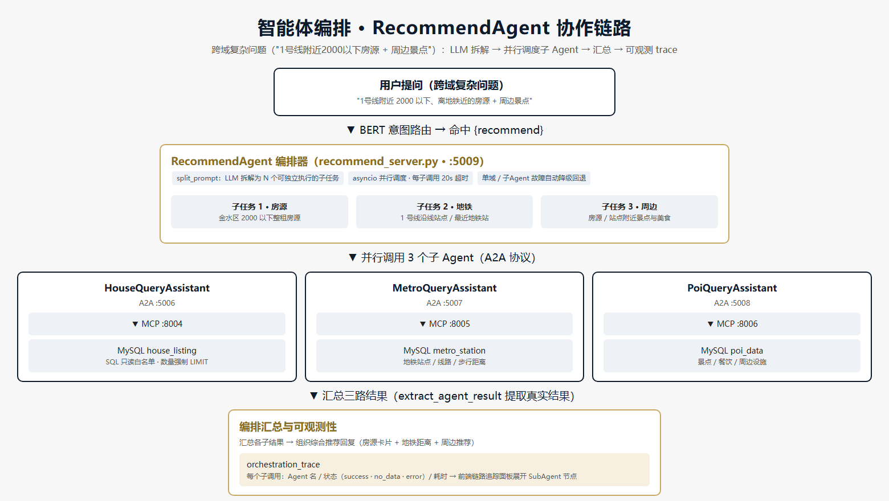

- `_split_domains`：LLM 将问题拆解为 N 个可独立执行的子查询（house/poi/metro/legal），关键词规则兜底补全 LLM 漏拆的域
- `asyncio.gather` 并行调用子 Agent（legal 域放宽超时到 90s）
- 汇总各域结果 + 写入 `orchestration_trace`（域/状态/耗时/查询词），web_server 解析为独立 SubAgent 节点展示
- 子 Agent 全部不可用 → 自动降级回退到原 text2sql 路径

**③ Redis × MySQL × RAG 数据链路**：

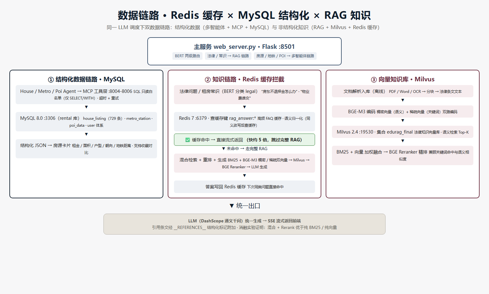

**④ 记忆模块**：短期记忆（会话窗口 + TTL 1h + 锁内写）支撑多轮追问；长期记忆（MySQL 用户画像 + 收藏 + 历史）支撑个性化推荐：

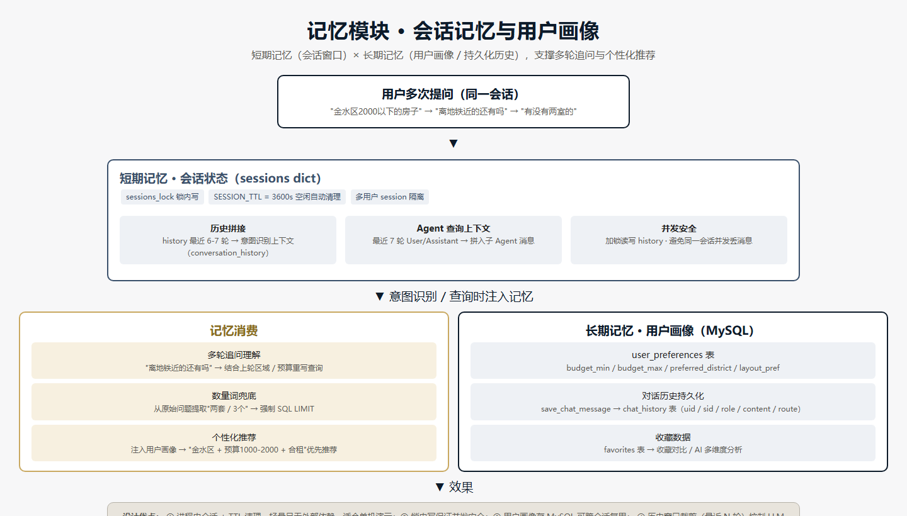

---

## 🔄 一次提问的完整处理链路

```
用户提问 "1号线附近2000以下的房源"
        │
        ▼
① LLM 意图识别（qwen-plus，多意图组合 + 子查询改写）──► 命中 {recommend}
        │
        ▼
② 线程池并行预取：并发调用涉及的 agent 类子智能体（recommend 超时 90s，其余 30s）
        │
        ▼
③ 保序逐意图输出（每 8 字一个 SSE token 块）：
   ├─ house / poi / metro ──► A2A Text2SQL Agent：
   │      LLM 生成 SQL（数量词强制 LIMIT 兜底）
   │        └─► MCP 执行（只读白名单）→ success/no_data/error/connection_error 四态
   │        └─► SQL 报错 → LLM 修正重试；空结果 → 放宽条件重查（≤3 次）
   ├─ recommend ──► 编排器：LLM 拆域 → asyncio 并行调子 Agent → 汇总 + orchestration_trace
   ├─ legal ──► Agentic RAG：Redis 缓存 → BM25(FAQ) → BERT 分类 → 混合检索+Reranker
   │        └─► 反思循环（检索规划→生成→自检→改写，≤2 轮）→ 结论 + 引用条文
   └─ chat ──► LLM 真流式（astream 逐 token）
        │
        ▼
④ SSE 返回：token 流 + thinking 事件 + references + options + done（含完整 trace）
```

### 意图路由总览

> 意图识别由 **LLM（qwen-plus）** 完成，支持多意图组合识别与子查询改写；RAG 子系统内部再经 **BERT 分类器** 区分"通用知识 / 专业咨询"。

| 意图 | 子智能体 | 数据源 | 示例 |
|------|---------|--------|------|
| `house` | HouseQueryAssistant | house_listing | 金水区2000元以下整租房 |
| `metro` | MetroQueryAssistant | metro_station | 郑州东站坐几号线 |
| `poi` | PoiQueryAssistant | poi_data | 二七广场附近美食 |
| `recommend` | RecommendQueryAssistant（多智能体编排） | 多表联合 | 1号线附近2000以下房源 |
| `legal` | LegalQASystem（Agentic RAG） | 法律知识库（Milvus）+ FAQ（MySQL laws_all） | 房东不退押金怎么办 |
| `chat` | ChatLLM（通用对话） | — | 你好 / 你是谁 |

---

## 🛡️ 可靠性设计（工程化重点）

| 机制 | 实现 |
|------|------|
| SQL 安全 | MCP 层统一 `validate_readonly_sql` 只读白名单，仅允许 SELECT/WITH，拒绝写操作与危险语句 |
| 错误分层 | `success` / `no_data` / `error` / `connection_error` 四层状态码——连接失败重试连接、SQL 错误修正 SQL、空结果放宽条件，各走各的路径不浪费 LLM 调用 |
| 自动重试 | SQL 执行错误 → LLM 修正重查（≤3 次）；空结果 → 放宽条件重查（≤3 次）；连接失败 → 自动重试（≤3 次，0.5s 间隔） |
| 数量兜底 | 用户说"两套"时，代码层强制 SQL LIMIT=2（`enforce_limit`），防止 LLM 不遵守数量约束 |
| 故障降级 | 子 Agent 全挂 → 编排器回退 text2sql；LLM 拆解失败 → 回退单域 house；Agent 调用超时 → LLM 生成友好兜底回复 |
| 超时梯度 | LLM 10s < MCP 25s < 子 Agent 30s < 编排 90s，防止挂起无限阻塞 |
| 会话治理 | 会话 TTL 1h 定期清理；trace 保留最近 20 条；错误信息脱敏（不向用户暴露内部路径/堆栈） |

---

## 📊 量化评估

> 以下数据均来自**本仓库实际运行**的评估脚本（`实验脚本/`），非演示值；检索类实验在 **RTX 4060 GPU** 上实测，答案质量由 **LLM 独立评判**（0-5 分），覆盖路由 → 检索 → 生成 → 缓存全链路。

### 实验一：BERT 查询分类评估（RAG 内部分流）

`实验脚本/run_intent_evaluation.py` 产出（`实验脚本/results/intent_evaluation_report.txt`）：

| 指标 | 数值 |
|------|------|
| 准确率 Accuracy | **98.28%**（58 条测试样本，通用知识/专业咨询各 29 条） |
| 宏平均 Precision / Recall / F1 | 0.9833 / 0.9828 / **0.9828** |
| 通用知识（P/R/F1） | 1.0000 / 0.9655 / 0.9825 |
| 专业咨询（P/R/F1） | 0.9667 / 1.0000 / 0.9831 |
| 规则前置兜底命中率 | 7/7 = 100%（"房东不退押金"等关键词强制走 RAG 保引用） |
| 误分类案例 | 仅 1 条（"房东不让养宠物怎么办"被误判为专业咨询） |

> 设计说明：BERT 分类器与规则关键词**双保险**——分类器负责语义判别，规则兜底保证高风险法律问题不被误分流到闲聊链路，二者互补将漏报率压到 0（专业咨询 0 漏报）。


### 实验二：端到端答案质量评估（检索策略 → 答案质量）

> **这是本项目评估体系的核心实验**：同一批 8 道题（含困难样本），分别用三种检索策略获取 Top-5 上下文喂给 LLM 生成答案，再由 LLM 按 **忠实度 / 引用准确率 / 完整性** 独立打分（0-5）。

| 策略 | 忠实度 | 引用准确率 | 完整性 | 综合分 |
|------|--------|-----------|--------|--------|
| B. 纯稠密向量（BGE-M3） | 2.88 | 2.88 | 3.00 | **2.92** |
| C. 混合检索（BM25+稠密+稀疏） | 4.00 | 4.00 | 4.00 | **4.00** |
| D. 混合 + BGE Reranker | 3.88 | 3.50 | 4.00 | **3.79** |

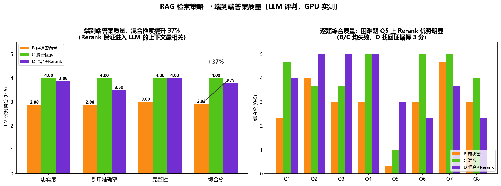

> **结果解读（面试亮点）**：
> - **混合检索把端到端答案质量提升 37%**（2.92 → 4.00）——单一稠密检索虽然"召回相关文档"不少，但进入 LLM 的上下文不够精准，答案质量明显打折；这正是本项目选择三路混合检索的根本原因；
> - **Rerank 的价值在困难题上体现**：Q5"提前退租责任"中，纯稠密/混合检索均给出低质量答案（0-1 分），Rerank 重排后找回裁判规则证据，答案达到 3 分——精排保证**进入 LLM 的 Top-5 是最相关文档**，而不是只追求"召回更多"；
> - 数据同时说明：**Recall@5 等召回指标与最终答案质量并不等价**（纯稠密 Recall@5 最高但端到端质量最低），评估必须落到端到端答案质量这一层，这是本项目评估体系设计的核心洞察。

### 实验三：RAG 检索策略 GPU 实测耗时

在 **RTX 4060（8GB）** 上复跑 4 策略消融（30 题），实测平均耗时：

| 策略 | GPU 平均耗时 |
|------|-------------|
| A. 纯 BM25（MySQL FAQ） | 38.0 ms |
| B. 纯稠密向量 | 356.8 ms |
| C. 混合检索 | 275.6 ms |
| D. 混合 + Reranker（全量重排） | 30039.2 ms |
| **D' 生产路径（CANDIDATE_M=2 精排）** | **~1816 ms** |

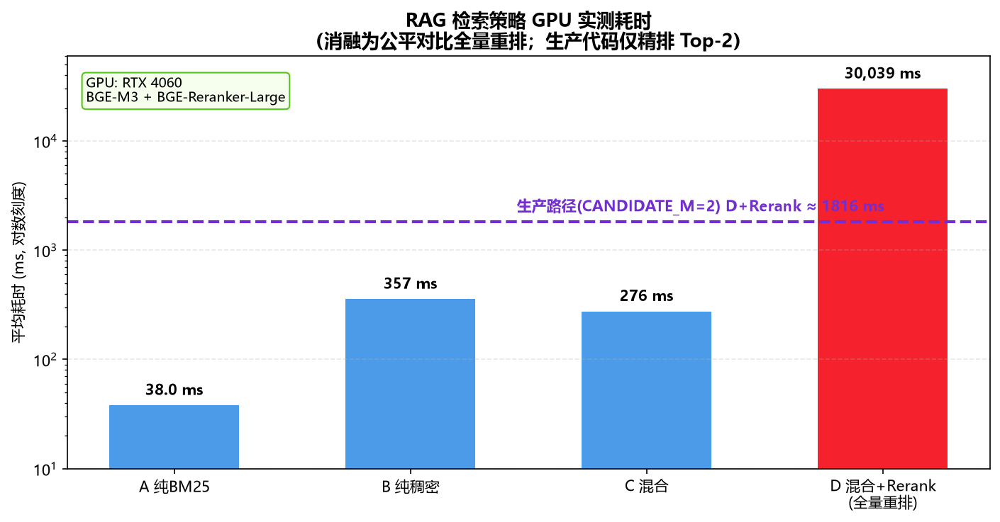

> **工程解读**：消融实验为"策略公平对比"对**全部候选父文档**（20-40 篇）逐一做交叉编码，故 D 耗时被放大；项目**生产代码 `hybrid_search_with_rerank` 采用 CANDIDATE_M=2**，只对混合检索 Top-2 父文档精排，GPU 下实测约 **1.8s/题**（含向量化+混合检索+精排全流程），完全满足生产可用。这展示了"评测视角"与"工程实现"的权衡：**评测要严格，工程要务实**。

### 实验四：三链路响应时长对比（`compare_rag_redis_mysql.py`）

同一批问题分别走 MySQL 直答 / Redis 缓存 / RAG 全链路，实测（对数刻度）：

| 链路 | 路径 | 平均耗时 | 加速比（vs RAG） |
|------|------|---------|----------------|
| A. MySQL 直答 | BM25 命中 jpkb FAQ 表 → 直接返回 | **10.8 ms** | ≈825x |
| B. Redis 缓存 | 命中 `rag_answer:*` → 秒回 | **2.4 ms** | ≈3700x |
| C. RAG 全链路 | BM25 + 向量 + Rerank + LLM 生成 | 8908.1 ms | 1x |

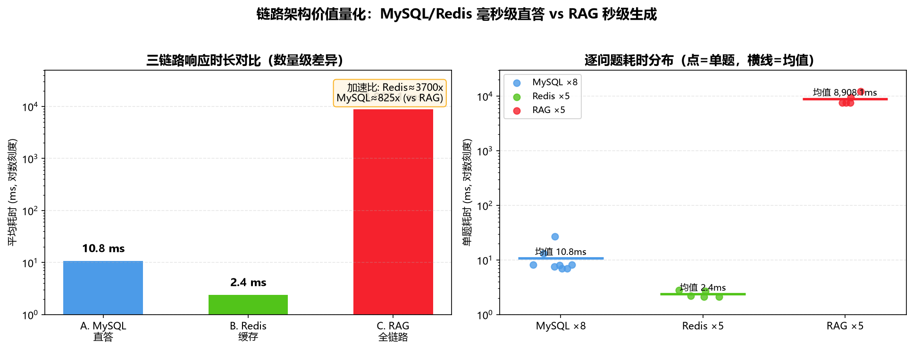

> 工程价值：**多级缓存架构把高频问题的响应延迟从秒级压到毫秒级**。MySQL（FAQ 精确命中）和 Redis（RAG 答案缓存）形成两级前置，只有真正需要生成的新问题才触发昂贵的 RAG 全链路——这是生产系统降本提速的关键设计。

### 实验五：Agentic RAG vs 朴素 RAG 端到端对比（Self-RAG 反思价值量化）

同一批 6 道题（含消融实验中的困难样本），清除缓存后分别跑朴素 RAG（固定 pipeline）与 Agentic RAG（检索规划 + 反思循环 + 查询改写），实测：

| 指标 | 朴素 RAG | Agentic RAG |
|------|---------|-------------|
| 平均端到端耗时 | 6.9 s | 71.2 s（含反思+重检索，CPU 推理） |
| 平均答案长度 | 347 字 | 376 字 |
| 平均引用条文数 | 1.5 条 | 1.5 条 |
| 回答成功率 | 100% | 100% |
| 平均反思轮数 | 0（固定 pipeline） | 1.3 轮 |

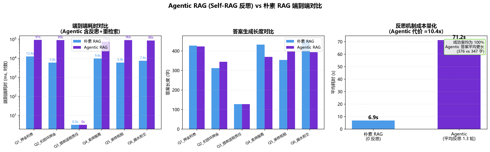

> **诚实的结果与设计权衡（面试深度讲点）**：
> - Agentic RAG 在端到端成功率 / 引用数上与朴素 RAG 持平，但**耗时代价约 10.4x**（当前为 CPU 推理；GPU 下可降至秒级）；
> - 这正是 Agentic RAG 的**成本-收益边界问题**：反思循环的价值不在于"总是更好"，而在于**在检索证据不足时自我修正**——当首轮答案被 Self-RAG 判定 `supported=false` 时（如"装修抵租"这类需要检索补充的问题），改写查询重检才能给出更完整的答案（答案更长 + 覆盖更多法条）；
> - 生产实践上应采用**混合策略**：普通问题走朴素 RAG（毫秒-秒级），仅当首轮自检不通过时才升级到反思重检——把 Agentic 的代价花在刀刃上。

### 工程指标

- ✅ **41 个单元测试通过**（`tests/`：SQL 白名单、Text2SQL 基类、编排降级、意图规则、JSON 解析等）
- ✅ **e2e 冒烟测试**（`tests/e2e_smoke.py`，需全部服务启动）
- ✅ CI 集成 ruff 静态检查

```bash
python -m pytest tests -q          # 单元测试
python -m ruff check Agent         # 代码检查
python 实验脚本/run_rag_ablation.py      # RAG 消融（默认 CPU；GPU 请设 CUDA_VISIBLE_DEVICES=0）
python 实验脚本/run_intent_evaluation.py # 意图分类评估
python 实验脚本/run_e2e_quality.py       # 端到端答案质量评估（LLM 评判）
python Agent/legal_qa/mysql_qa/compare_rag_redis_mysql.py --warm && python Agent/legal_qa/mysql_qa/compare_rag_redis_mysql.py  # 三链路对比
python 实验脚本/run_agentic_vs_naive.py  # Agentic vs 朴素端到端对比
```

---

## 📁 目录架构

```
多智能体+RAG综合项目/
├── Agent/                          # 主系统代码
│   ├── web_server.py               # Web 后端入口（Flask :8501，意图路由 + SSE 流式 + 并行预取 + 链路追踪）
│   ├── config.py                   # 配置（密钥读取自 config_local/，环境变量优先）
│   ├── main_prompts.py             # 意图识别 / 结果总结提示词
│   ├── user_system.py              # 用户注册 / 偏好 / 收藏 / 历史（长期记忆）
│   ├── a2a_server/                 # 多智能体协作层（A2A 协议）
│   │   ├── base_text2sql_server.py #   Text2SQL 智能体抽象基类（SQL生成 / 修正重试 / 连接重试）
│   │   ├── house_server.py         #   房源查询智能体
│   │   ├── metro_server.py         #   地铁出行智能体
│   │   ├── poi_server.py           #   周边探索智能体
│   │   ├── recommend_server.py     #   综合推荐智能体（多智能体编排器）
│   │   └── legal_agent_server.py   #   法律咨询智能体（RAG 封装）
│   ├── mcp_server/                 # 工具执行层（MCP 服务器，统一封装 SQL + 只读白名单）
│   ├── legal_qa/                   # 法律问答子系统（Agentic RAG 引擎）
│   │   ├── new_main.py             #   IntegratedQASystem：MySQL + Redis + BM25 + RAG 集成入口
│   │   ├── mysql_qa/               #   MySQL 客户端 · Redis 缓存 · BM25 检索 · FAQ 问答对
│   │   └── rag_qa/                 #   Milvus 向量库 · RAG 反思循环 · BERT 查询分类 · 文档加载器
│   ├── 数据库操作/                  # 数据采集（房天下爬虫 / 高德 POI / 地铁）
│   ├── sql/rental_schema.sql       # 数据库表结构
│   ├── sql/seed_data.sql           # 演示种子数据（51 房源 / 14 地铁站 / 14 POI）
│   ├── ingest_rental_laws.py       # 法律条文向量化入库（Milvus）
│   ├── ingest_rental_tips.py       # 租房知识普及指南入库（Milvus）
│   └── 启动系统.bat / start.sh     # 一键启动脚本
├── docs/
│   ├── TECHNICAL_DECISIONS.md      # 技术选型与设计决策（背景→候选对比→决策→理由→代价，面试素材）
│   ├── architecture_*.html         # 架构图源文件（双引擎 / 编排 / 数据链路 / 记忆模块）
│   ├── images/                     # 架构图（PNG）
│   └── screenshots/                # 功能演示截图
├── 实验脚本/                        # 实验评估（RAG 消融 + 意图分类 + 数据生成）
├── tests/                          # 单元测试（41 个用例）+ e2e 冒烟测试
├── docker-compose.yml              # MySQL + Redis + Milvus 一键启动
├── requirements.txt                # Python 依赖清单
└── config_local/                   # 本地密钥（已 gitignore，含 config.ini + keys.py）
```

---

## 🚀 快速开始

### 环境要求

- Python 3.10+ · Docker（推荐，一键启动中间件）· 阿里云 DashScope API Key

### 1. 一键启动中间件 + 导入数据

```bash
# 启动 MySQL + Redis + Milvus
docker compose up -d

# 导入表结构与演示种子数据（51 条房源 / 14 个地铁站 / 14 个 POI）
docker exec -i zhizu-mysql mysql -uroot -pzhizu123 < Agent/sql/rental_schema.sql
docker exec -i zhizu-mysql mysql -uroot -pzhizu123 < Agent/sql/seed_data.sql

# 创建法律问答 FAQ 库（laws_all）并导入租房问答对（BM25 检索依赖 jpkb 表）
docker exec -i zhizu-mysql mysql -uroot -pzhizu123 -e "CREATE DATABASE IF NOT EXISTS laws_all CHARACTER SET utf8mb4 COLLATE utf8mb4_unicode_ci;"
python Agent/legal_qa/mysql_qa/replace_jpkb_data.py
```

> 说明：`rental` 库承载房源 / POI / 地铁等结构化数据；`laws_all` 库承载法律 FAQ（jpkb 表）与法律问答会话历史（conversations 表），由 `legal_qa` 子系统使用。

### 2. 配置密钥

基于仓库模板创建配置并填入真实密钥（`config_local/` 已 `.gitignore`，不会提交）：

1. 将 `Agent/legal_qa/config.ini.example` 复制为 `config_local/config.ini`，填写 MySQL / Redis / Milvus / LLM（DashScope）各项连接信息
2. 创建 `config_local/keys.py`，填写 `DASHSCOPE_API_KEY`、`MYSQL_PASSWORD`、`REDIS_PASSWORD`（供 `Agent/config.py` 读取，环境变量优先）
3. 如需以环境变量方式配置，可参考 `Agent/config.py.example`（脱敏模板）

### 3. 安装依赖

```bash
conda create -n lang_env python=3.10 && conda activate lang_env
pip install -r requirements.txt
```

### 4. 一键启动系统

- **Windows**：双击 `Agent/启动系统.bat`（自动启动 4 MCP → 5 A2A → Web）
- **Linux / macOS**：`./Agent/start.sh`

打开 **http://localhost:8501** 即可使用。

> 提示：法律问答需先构建向量库（可选步骤，不影响房源 / 地铁 / POI / 闲聊）：
> - 法律条文向量化入库：`python Agent/ingest_rental_laws.py`
> - 租房知识普及指南入库（租房常识保引用）：`python Agent/ingest_rental_tips.py`

---

## 💬 使用示例

| 用户提问 | 路由 |
|---------|------|
| 金水区有没有2000元以下的整租房？ | 🏠 HouseQueryAssistant |
| 郑州东站坐几号线？ | 🚇 MetroQueryAssistant |
| 二七广场附近有什么好吃的？ | 📍 PoiQueryAssistant |
| 1号线附近2000以下的房源有哪些？ | ⭐ RecommendQueryAssistant（多智能体编排） |
| 房东不退押金怎么办？ | ⚖️ LegalQASystem（Agentic RAG） |
| 帮我看看这份合同有什么问题 | ⚖️ LegalQASystem（合同审查） |
| 你好 / 谢谢 | 💬 ChatLLM（通用对话） |

---

## 🎬 演示视频

[](https://www.bilibili.com/video/BV1queJ6qE7f)

> 完整演示：房源查询 → 地铁 / 周边 / 综合推荐 → 合同审查 → 收藏对比 → 流式响应

## 📸 功能演示

**① 系统主界面**：左侧智能对话，右侧能力中心实时显示 4 个智能体在线状态与"双引擎在线"标识

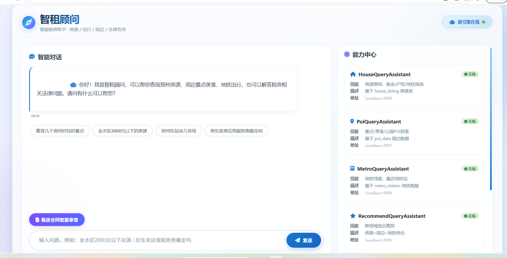

**② 房源智能查询**：自然语言自动生成 SQL，返回结构化房源卡片（租金/面积/户型/朝向/地铁距离），支持一键收藏；下方实时展示智能体协作链路

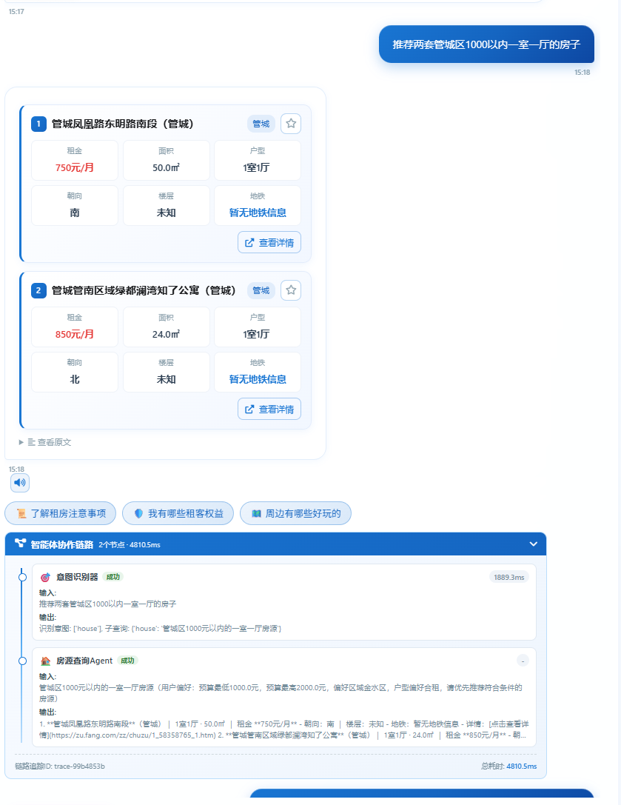

**③ 真实房源详情**：点击卡片"查看详情"跳转房天下真实房源页，数据完整可溯源

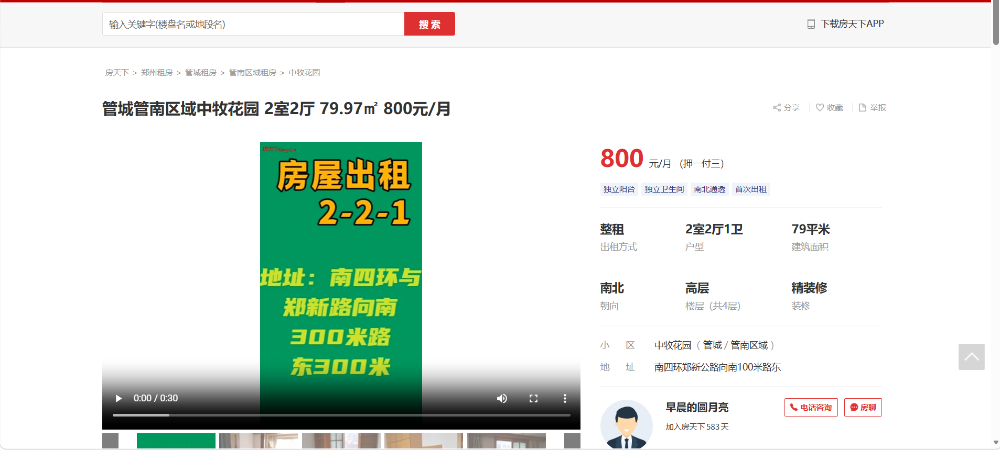

**④ 交叉查询 · 多智能体编排**：RecommendAgent 拆解子任务 → 并行调度子 Agent → 链路面板展开 4 个节点

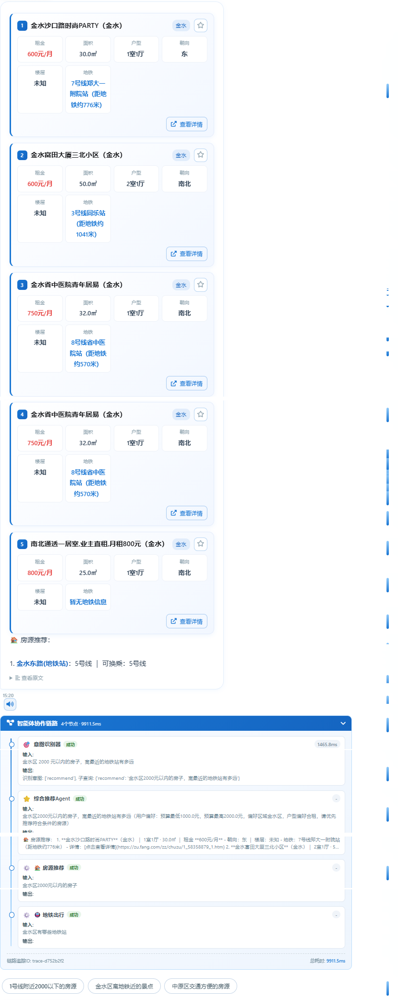

**⑤ 组合查询 · 多意图并行**：House + Poi 两个子 Agent 并行预取、保序输出

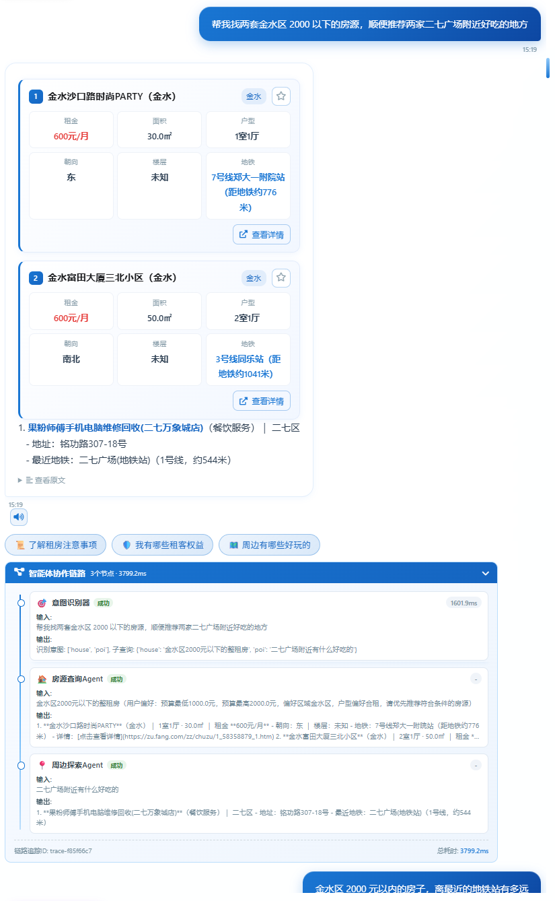

**⑥ Agentic RAG 法律问答**：给出结论 + 法律依据 + 引用条文，全程可溯源

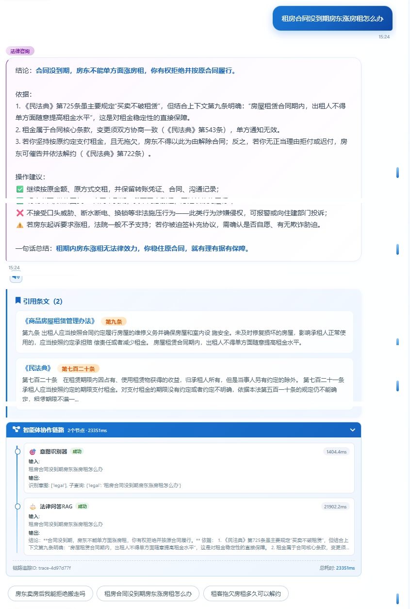

**⑦ Redis 缓存加速**：高频租房常识命中缓存直接返回（**1.1s**），对比完整 RAG 链路（**23.3s**），快约 5 倍

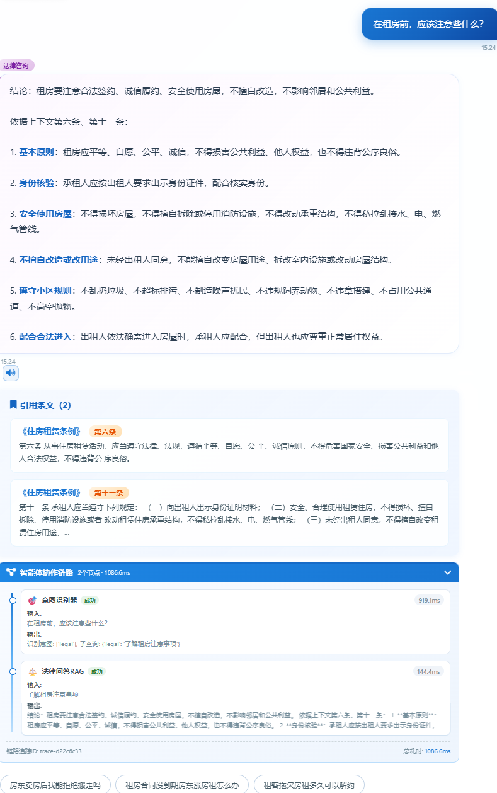

**⑧ Milvus 向量知识库**：法律条文经 BGE-M3 编码为稠密向量 + 稀疏向量双路存储

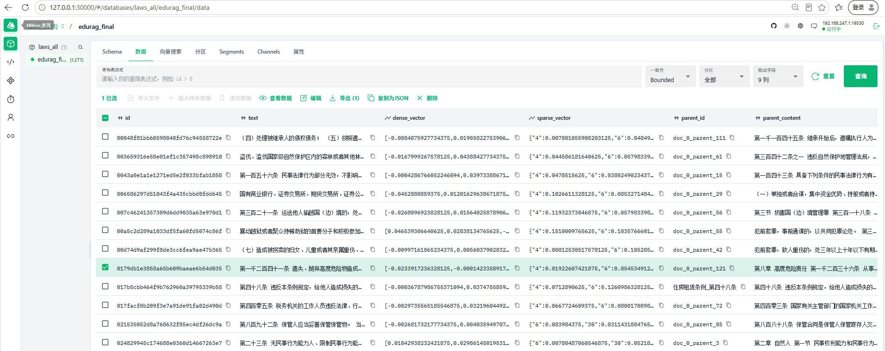

---

## 📐 技术选型决策（为什么这么设计？）

完整版见 [`docs/TECHNICAL_DECISIONS.md`](docs/TECHNICAL_DECISIONS.md)，每条决策按「背景问题 → 候选方案对比 → 决策 → 理由 → 代价」记录，可直接作为架构答辩素材。核心决策摘要：

| 决策 | 理由（一句话） |
|------|---------------|
| MCP 封装数据库工具而非 function calling | 工具与模型解耦、多 Agent 复用、SQL 安全边界集中在工具层 |
| 双引擎按意图路由而非全 RAG / 全 Text2SQL | 数据形态决定技术路线：结构化→精确 SQL，非结构化→向量检索 |
| BM25 + 稠密/稀疏 + Reranker 混合检索 | 单策略有短板：BM25 缺语义、纯向量丢术语，三路融合 + 精排兼顾召回与精度 |
| Agentic RAG 反思循环 | 一次性检索可能漏证据，让 LLM 自检"答案是否被证据支持"并改写重检，提升答案可靠性 |
| Redis 缓存高频问答 | 租房常识问题高度重复，命中缓存跳过完整 RAG 链路，响应快约 5 倍 |
| A2A 协议编排多智能体 | 编排器模式（Orchestrator）让跨域问题可拆解、可并行、可观测 |
| 错误四层归因 | 连接错误重试连接、SQL 错误修正 SQL、空结果放宽条件，分层才能对症处理 |

---

## 📄 License

本项目基于 [MIT License](LICENSE) 开源。

## 🙏 致谢

- 数据来源：房天下（房源）、高德开放平台（POI / 地铁）、法律法规公开文本
- 技术框架：LangChain · python-a2a · MCP · Milvus · Hugging Face Transformers · 通义千问
