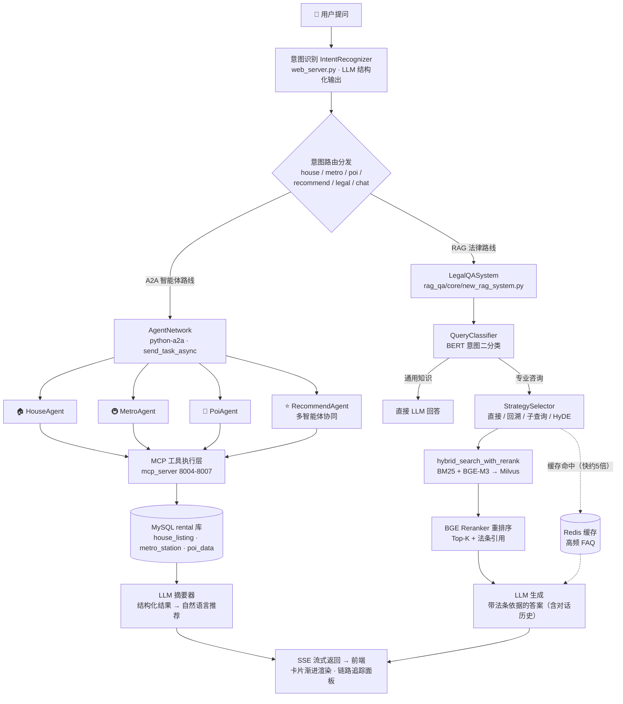

# 🏠 基于多智能体与RAG的智能租房咨询系统

一个面向郑州本地租房场景的 **多智能体协作 + 检索增强生成（RAG）** 智能问答系统：输入自然语言，系统自动识别意图、编排多个子智能体协同查询（房源 / 地铁 / 周边 / 综合推荐），并内置基于 RAG 的法律问答引擎，支持租房合同审查与高频常识问答。

> 技术栈：多智能体（A2A 协议） · MCP 工具调用 · BERT 意图分类 · BM25 + 稠密向量混合检索 · BGE Reranker · Milvus · Redis 缓存 · 通义千问 LLM

---

## 🎬 演示视频

[](https://www.bilibili.com/video/BV1queJ6qE7f)

> 完整演示：房源查询 → 地铁 / 周边 / 综合推荐 → 合同审查 → 收藏对比 → 流式响应

---

## ✨ 亮眼功能

| 功能 | 亮点 |
|------|------|
| 🧠 **多智能体协作** | 4 个子智能体通过 A2A 协议互联，复杂问题（如"1号线附近2000以下房源"）自动编排多个智能体协同回答 |
| 🔍 **RAG 混合检索** | BM25 关键词 + BGE-M3 稠密/稀疏向量加权融合，再经 BGE Reranker 重排序，兼顾召回与精度 |
| 🎯 **BERT 意图分类** | 基于 `bert-base-chinese` 微调，支持多意图组合识别，租房常识关键词强制走 RAG 保引用 |
| ⚡ **SSE 流式响应** | 前端流式输出 + 房源卡片渐进式渲染，解析到一套就渲染一套，观感极佳 |
| 🔗 **智能体链路追踪** | 每次提问实时展示调用了哪些智能体、顺序、耗时（多智能体可观测性） |
| 🚀 **Redis 缓存加速** | 高频问题命中缓存，跳过完整 RAG 链路，响应快约 **5 倍** |
| ⚖️ **合同上传审查** | 支持上传租房合同文件（OCR/PDF/Word），基于 RAG 给出法律风险分析 |
| ⭐ **收藏对比分析** | 收藏房源后可 AI 生成多维度对比（租金性价比 / 通勤 / 周边配套） |
| 🕷️ **真实数据采集** | 贝壳租房爬虫 + 高德 POI / 地铁数据，郑州本地 700+ 条真实房源 |

---

## 🏗️ 系统架构

```
┌─────────────────────────────────────────────────────────┐
│  前端展示层  Agent/新版网页.html                          │
│  SSE 流式输出 · 房源卡片 · 收藏对比 · 链路追踪面板         │
└──────────────────────┬──────────────────────────────────┘
                       │ HTTP + SSE (Flask, :8501)
┌──────────────────────▼──────────────────────────────────┐
│  主服务层  Agent/web_server.py                           │
│  意图识别(BERT) · 路由分发 · 会话管理 · LLM 总结           │
└──────────────────────┬──────────────────────────────────┘
                       │ A2A 协议 (python-a2a)
┌──────────────────────▼──────────────────────────────────┐
│  多智能体协作层  a2a_server/                             │
│  HouseAgent 🏠 · MetroAgent 🚇 · PoiAgent 📍             │
│  RecommendAgent ⭐ · LegalQA ⚖️ (RAG) · ChatLLM 💬       │
└──────────────────────┬──────────────────────────────────┘
                       │ MCP 工具调用
┌──────────────────────▼──────────────────────────────────┐
│  工具执行层  mcp_server/                                 │
│  mcp_house · mcp_metro · mcp_poi · mcp_recommend         │
└──────────────────────┬──────────────────────────────────┘
                       │ SQL / 向量检索
┌──────────────────────▼──────────────────────────────────┐
│  数据存储层                                              │
│  MySQL(房源/POI/地铁/FAQ) · Milvus(向量) · Redis(缓存)   │
│  DashScope LLM(qwen) · BGE Reranker                     │
└─────────────────────────────────────────────────────────┘
```

---

## 🔄 核心流程与逻辑

> **双引擎架构总览**：结构化数据查询（房源/地铁/POI）走 **A2A 多智能体 + MCP** 链路；非结构化法律知识走 **RAG 检索增强生成** 链路。两条链路由意图路由统一调度，最终经 SSE 流式返回前端。



### 1. 一次提问的完整处理链路

```
用户提问 "1号线附近2000以下的房源"
        │
        ▼
① BERT 意图分类 ──► 命中 {recommend}（跨领域组合意图）
        │
        ▼
② 主服务路由分发：生成多个子查询
        │
        ├──► RecommendAgent 发起协作
        │       │
        │       ├──► HouseAgent ──MCP──► MySQL house_listing（租金≤2000）
        │       ├──► MetroAgent ──MCP──► MySQL metro_station（1号线站点）
        │       └──► PoiAgent   ──MCP──► MySQL poi_data（站点周边）
        │
        ▼
③ 各智能体返回结构化结果 → RecommendAgent 汇总
        │
        ▼
④ LLM 总结生成推荐语（含推荐理由）
        │
        ▼
⑤ SSE 流式返回前端（卡片渐进渲染 + 链路追踪可视化）
```

### 2. 法律问答的双路线响应

```
用户提问 "房东不退押金怎么办"
        │
        ▼
① 关键词兜底：命中租房常识关键词 → 强制走专业咨询
        │
        ▼
② 查 Redis 缓存 ──命中──► 直接返回（快 5 倍）
        │
        ▼ 未命中
③ RAG 混合检索：BM25 + BGE 稠密/稀疏向量
        │
        ▼
④ BGE Reranker 重排序取 Top-K
        │
        ▼
⑤ 拼接上下文 → LLM 生成引用法条的答案 → 写回缓存
```

### 3. 意图路由总览

| 意图 | 子智能体 | 数据源 | 示例 |
|------|---------|--------|------|
| `house` | HouseQueryAssistant | house_listing | 金水区2000元以下整租房 |
| `metro` | MetroQueryAssistant | metro_station | 郑州东站坐几号线 |
| `poi` | PoiQueryAssistant | poi_data | 二七广场附近美食 |
| `recommend` | RecommendQueryAssistant（多智能体协作） | 多表联合 | 1号线附近2000以下房源 |
| `legal` | LegalQASystem（RAG） | 法律知识库 + FAQ | 房东不退押金怎么办 |
| `chat` | ChatLLM（通用对话） | — | 你好 / 你是谁 |

---

## 📁 目录架构

```
多智能体+RAG综合项目/
├── Agent/                          # 主系统代码
│   ├── web_server.py               # Web 后端入口（Flask :8501，意图路由 + SSE 流式）
│   ├── config.py                   # 配置（密钥读取自 config_local/）
│   ├── main_prompts.py             # 意图识别 / 各智能体总结提示词
│   ├── user_system.py              # 用户系统（收藏 / 历史）
│   ├── a2a_server/                 # 多智能体协作层（A2A 协议）
│   │   ├── house_server.py         #   房源查询智能体
│   │   ├── metro_server.py         #   地铁出行智能体
│   │   ├── poi_server.py           #   周边探索智能体
│   │   └── recommend_server.py     #   综合推荐智能体（多智能体编排）
│   ├── mcp_server/                 # 工具执行层（MCP 服务器，统一封装 SQL）
│   │   ├── mcp_house_server.py     #   房源查询 MCP
│   │   ├── mcp_metro_server.py     #   地铁查询 MCP
│   │   ├── mcp_poi_server.py       #   POI 查询 MCP
│   │   └── mcp_recommend_server.py #   综合推荐 MCP
│   ├── legal_qa/                   # 法律问答子系统
│   │   ├── base/                   #   基础配置与日志
│   │   ├── mysql_qa/               #   MySQL FAQ 检索（BM25 + Redis 缓存）
│   │   └── rag_qa/                 #   RAG 引擎（向量检索 + Reranker + BERT 意图分类）
│   │       ├── core/               #     向量库 / 分类器 / RAG 系统 / 策略选择
│   │       ├── data/               #     民法典 / 刑法 / 劳动法等法律文本
│   │       └── edu_document_loaders/  # 文档加载（OCR / PDF / Word / PPT）
│   ├── 数据库操作/                  # 数据采集
│   │   ├── 爬虫.py                 #   贝壳租房郑州站房源爬虫
│   │   ├── fetch_metro.py          #   高德地铁站数据
│   │   └── update_poi_metro.py     #   POI 地铁关联补齐
│   ├── sql/rental_schema.sql       # 数据库表结构
│   ├── 新版网页.html                # 前端页面
│   └── 启动系统.bat                 # 一键启动脚本
├── 实验脚本/                        # 实验评估（消融实验 + 意图评估）
│   ├── run_rag_ablation.py         #   RAG 检索策略消融实验（4 策略对比）
│   ├── run_intent_evaluation.py    #   BERT 意图分类评估
│   └── data/                       #   测试数据集
├── 数据集/                          # 爬取的法律文本 / 测试数据
├── config_local/                   # ⚠️ 本地密钥（.gitignore 忽略，不提交）
├── tests/                          # 单元测试（25 个用例）
├── requirements.txt                # Python 依赖清单
└── .gitignore
```

---

## 🚀 快速开始

### 环境要求

- Python 3.10+
- MySQL 8.0+（数据库 `rental`，表结构见 `Agent/sql/rental_schema.sql`）
- Milvus 2.x 向量数据库（集合 `edurag_final`）
- Redis 6+（缓存）
- 阿里云 DashScope（通义千问）API Key
- （可选）GPU：BERT / BGE 模型 CPU 也可运行但较慢

### 1. 安装依赖

```bash
pip install -r requirements.txt
```

> 建议 conda 虚拟环境：`conda create -n lang_env python=3.10`
> OCR 文档入库需额外安装可选依赖（见 requirements.txt 末尾注释）。

### 2. 配置密钥

真实密钥统一放 `config_local/`（已被 `.gitignore` 忽略，不会提交）：

```
config_local/
├── config.ini     # MySQL / Redis / Milvus / LLM 配置
└── keys.py        # DASHSCOPE_API_KEY / AMAP_API_KEY / MYSQL_PASSWORD / REDIS_PASSWORD
```

复制仓库中的模板（`Agent/config.py.example`、`Agent/legal_qa/config.ini.example`、`Agent/数据库操作/amap_key.example.py`），创建 `config_local/` 填入真实密钥即可，代码自动读取，无需设置环境变量。

### 3. 初始化数据

1. 执行 `Agent/sql/rental_schema.sql` 建表
2. 运行 `Agent/数据库操作/爬虫.py` 爬取房源（或使用 `数据集/` 已有数据）
3. 运行 `Agent/ingest_rental_laws.py` / `ingest_rental_tips.py` 构建法律知识向量库

### 4. 启动系统

**方式一：一键启动** —— 双击 `Agent/启动系统.bat`（自动启动 MCP → A2A → Web）。

**方式二：手动启动**

```bash
# MCP 服务器（4 个）
python -m mcp_server.mcp_house_server      # 8004
python -m mcp_server.mcp_poi_server        # 8005
python -m mcp_server.mcp_metro_server      # 8006
python -m mcp_server.mcp_recommend_server  # 8007

# A2A 智能体（4 个）
python -m a2a_server.house_server          # 5006
python -m a2a_server.poi_server            # 5007
python -m a2a_server.metro_server          # 5008
python -m a2a_server.recommend_server      # 5009

# Web 后端
python -m web_server                        # http://localhost:8501
```

打开浏览器访问 **http://localhost:8501** 即可使用。

---

## 💬 使用示例

| 用户提问 | 路由 |
|---------|------|
| 金水区有没有2000元以下的整租房？ | 🏠 HouseQueryAssistant |
| 郑州东站坐几号线？ | 🚇 MetroQueryAssistant |
| 二七广场附近有什么好吃的？ | 📍 PoiQueryAssistant |
| 1号线附近2000以下的房源有哪些？ | ⭐ RecommendQueryAssistant（多智能体协作） |
| 房东不退押金怎么办？ | ⚖️ LegalQASystem（RAG） |
| 帮我看看这份合同有什么问题 | ⚖️ LegalQASystem（合同审查） |
| 你好 / 谢谢 | 💬 ChatLLM（通用对话） |

---

## 📊 实验与评估

`实验脚本/` 包含两组可复现实验，产出论文 / 答辩所需的定量指标与图表：

1. **RAG 检索策略消融实验** —— 对比纯 BM25 / 纯稠密向量 / 混合检索 / 混合 + Reranker 四种策略（Recall@5、MRR、耗时）
2. **BERT 意图分类评估** —— 分类准确率、混淆矩阵、误分类案例与优化建议

```bash
python 实验脚本/run_rag_ablation.py
python 实验脚本/run_intent_evaluation.py
```

---

## 📄 License

本项目基于 [MIT License](LICENSE) 开源。

## 🙏 致谢

- 数据来源：贝壳租房、高德地图开放平台（POI / 地铁）、法律法规公开文本
- 技术框架：LangChain、python-a2a、MCP、Milvus、Hugging Face Transformers
