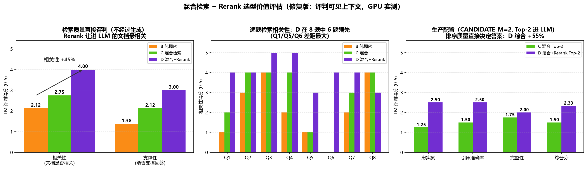
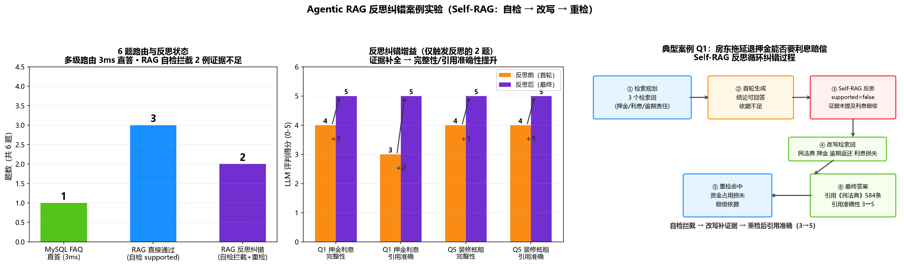
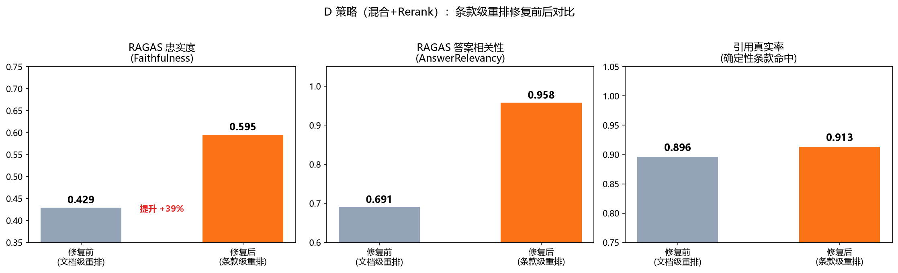
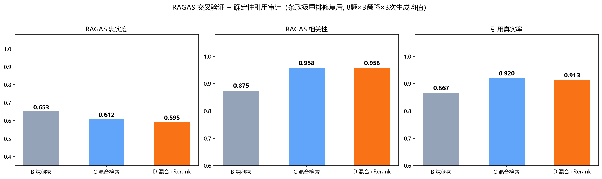

# 🏠 智租顾问 · 基于多智能体协作与 Agentic RAG 的智能租房咨询系统


面向郑州本地租房场景的 **多智能体协作 + Agentic RAG** 智能问答系统：输入一句自然语言，系统自动完成 **LLM 意图路由 → A2A 多智能体编排 / Agentic RAG 反思循环 → 数据库 / 知识库检索 → SSE 流式回复**，覆盖房源查询、地铁出行、周边探索、综合推荐、法律问答与合同审查六大场景。

> **技术栈**：Python 3.10 · Flask(SSE) · A2A 多智能体协议 · MCP 工具调用 · LangChain · LLM 意图路由（通义千问 qwen-plus） · BERT 查询分类 · BM25 + BGE-M3 混合检索 · BGE Reranker · Milvus 向量库 · Redis 缓存 · MySQL

---

## 🎯 项目定位与设计动机

租房咨询是典型的**异构数据 + 跨域知识**问答问题，单一技术路线无法优雅解决：

| 问题 | 数据形态 | 最优技术路线 |
|------|---------|-------------|
| "金水区 2000 元以下整租房" | 结构化（MySQL 表，需精确筛选） | Text2SQL Agent（精确 SQL 而非向量模糊检索） |
| "房东不退押金怎么办" | 非结构化（法律条文，需语义匹配 + 引用） | RAG 检索增强生成（向量 + 关键词 + 重排） |
| "1号线附近 2000 以下的房子 + 周边景点" | 跨域组合（同时涉及房源/地铁/POI） | 多智能体编排（拆解子任务 → 并行调度 → 汇总） |

**核心结论：数据形态决定技术路线。** 系统采用"双引擎 + 意图路由"架构——结构化数据走 **A2A 多智能体 + MCP** 链路，非结构化法律知识走 **Agentic RAG** 链路，由 LLM 意图路由统一调度，SSE 流式返回。

---

## ✨ 核心亮点

| 技术点 | 一句话说明 |
|------|-----------|
| 🧠 **Agentic RAG 反思循环** | Self-RAG 式：LLM 规划检索 → 生成 → 自检"答案是否被证据支持" → 不通过则改写查询重检（详见[核心机制](#-系统架构)与[实验五](#-量化评估)） |
| 🔀 **A2A 多智能体编排** | RecommendAgent 编排器 LLM 拆解跨域子任务 → `asyncio.gather` 并行调度 → 汇总，写入 `orchestration_trace` 实现多智能体可观测 |
| 🔍 **RAG 混合检索** | BM25 + BGE-M3 稠密/稀疏**三路加权融合** + BGE Reranker 精排（有消融与端到端评估数据） |
| 🎯 **两级意图路由** | 入口 LLM 意图识别（6 类多意图组合）；RAG 内部 BERT 微调分类器（98.28% 准确率）分流"通用知识/专业咨询" |
| 🛡️ **可靠性设计** | SQL 只读白名单 · 错误四层归因 · 自动重试/放宽重查 · 子 Agent 故障降级 · 数量词强制 LIMIT 兜底 |
| 🚀 **Redis 多层缓存** | 高频租房常识命中缓存 1.1s vs 完整 RAG 链路 23.3s（快约 5 倍）；BM25 语料、RAG 答案均缓存 |
| 📈 **SSE 流式 + 链路追踪** | token 流式输出 + 房源卡片渐进渲染；每次提问展示调用过的智能体/顺序/耗时 |

---

## 🏗️ 系统架构

> **双引擎架构**：结构化数据（房源 / 地铁 / POI）走 **A2A 多智能体 + MCP** 链路；非结构化法律知识走 **Agentic RAG** 链路，由 LLM 意图路由统一调度，SSE 流式返回。


### 核心机制详解

**① Agentic RAG 反思循环（Self-RAG）**：让 LLM 参与检索决策全流程，而非"检索一次就生成"：

```
用户问题 → ① 检索规划(LLM 自定检索词与策略) → ② 工具化检索(三路融合 + Rerank 精排 + 去重)
         → ③ LLM 生成(带引用) → ④ 反思自检(答案是否被证据支持)
              ├─ 支持 → 输出最终答案（反思轨迹可观测）
              └─ 不支持 → ⑤ 改写检索词 → 回到 ② 重检（最多 2 轮）
```

反思轨迹（`last_agentic_trace`）记录每轮检索词、文档数、支持判定与缺失证据，前端链路面板可视化——**可观测的 Agentic RAG**。

**② 多智能体编排（A2A Orchestrator）**：


- `_split_domains`：LLM 将问题拆解为 N 个独立子查询（house/poi/metro/legal），关键词规则兜底补全
- `asyncio.gather` 并行调用子 Agent → 汇总 + 写 `orchestration_trace` → 前端展开为 SubAgent 节点
- 子 Agent 全部不可用 → 自动降级回退原 text2sql 路径

**③ 数据链路与记忆模块**：


短期记忆（会话窗口 + TTL 1h）支撑多轮追问；长期记忆（MySQL 用户画像 + 收藏 + 历史）支撑个性化推荐。

---

## 🔄 一次提问的完整处理链路

```
用户提问 "1号线附近2000以下的房源"
   │ LLM 意图识别 ──► 命中 {recommend}
   ▼
线程池并发预取涉及的全部子智能体（recommend 超时 90s，其余 30s）→ 保序逐意图输出
   ├─ house/poi/metro ──► Text2SQL Agent：LLM 生成 SQL（LIMIT 兜底）→ MCP 只读白名单执行
   │        └─► SQL 报错→LLM 修正重试；空结果→放宽重查（≤3 次）
   ├─ recommend ──► 编排器：LLM 拆域 → asyncio 并行调子 Agent → 汇总 + trace
   ├─ legal ──► Agentic RAG：Redis 缓存 → BM25(FAQ) → BERT 分类 → 混合检索+Rerank → 反思循环（≤2 轮）
   └─ chat ──► LLM 真流式
SSE 返回：token 流 + thinking + references + options + done（含完整 trace）
```

### 意图路由总览

| 意图 | 子智能体 | 数据源 | 示例 |
|------|---------|--------|------|
| `house` | HouseQueryAssistant | house_listing | 金水区2000元以下整租房 |
| `metro` | MetroQueryAssistant | metro_station | 郑州东站坐几号线 |
| `poi` | PoiQueryAssistant | poi_data | 二七广场附近美食 |
| `recommend` | RecommendQueryAssistant（多智能体编排） | 多表联合 | 1号线附近2000以下房源 |
| `legal` | LegalQASystem（Agentic RAG） | 法律知识库（Milvus）+ FAQ（MySQL laws_all） | 房东不退押金怎么办 |
| `chat` | ChatLLM（通用对话） | — | 你好 / 你是谁 |

---

## 🛡️ 可靠性设计（工程化重点）

| 机制 | 实现 |
|------|------|
| SQL 安全 | MCP 层统一 `validate_readonly_sql` 只读白名单，仅允许 SELECT/WITH |
| 错误分层 | `success` / `no_data` / `error` / `connection_error` 四层状态码，各走各的修复路径 |
| 自动重试 | SQL 错误 → LLM 修正重查（≤3 次）；空结果 → 放宽重查（≤3 次）；连接失败 → 重试（≤3 次） |
| 数量兜底 | 用户说"两套"时代码层强制 SQL LIMIT=2（`enforce_limit`） |
| 故障降级 | 子 Agent 全挂 → 回退 text2sql；LLM 拆解失败 → 回退单域；超时 → LLM 友好兜底回复 |
| 超时梯度 | LLM 10s < MCP 25s < 子 Agent 30s < 编排 90s，防无限阻塞 |
| 会话治理 | 会话 TTL 1h 清理；trace 保留 20 条；错误信息脱敏 |

---

## 📊 量化评估

> 全部数据来自**本仓库实际运行**的评估脚本（`实验脚本/`），检索类实验在 **RTX 4060 GPU** 实测，答案质量由 **LLM 独立评判**（0-5 分，评判可见检索上下文），覆盖路由 → 检索 → 生成 → 缓存全链路。

### 实验一：BERT 查询分类评估（RAG 内部分流）

| 指标 | 数值 |
|------|------|
| 准确率 Accuracy | **98.28%**（58 条测试样本） |
| 宏平均 P / R / F1 | 0.9833 / 0.9828 / **0.9828** |
| 通用知识（P/R/F1） | 1.0000 / 0.9655 / 0.9825 |
| 专业咨询（P/R/F1） | 0.9667 / 1.0000 / 0.9831 |
| 规则前置兜底命中率 | 7/7 = 100%（关键词强制走 RAG 保引用） |
| 误分类案例 | 仅 1 条（"房东不让养宠物怎么办"被误判为专业咨询） |

> BERT 分类器与规则关键词**双保险**——语义判别 + 规则兜底，专业咨询漏报率压到 0。


### 实验二：混合检索 + Rerank 选型价值评估（三层证据）★核心

> `实验脚本/run_e2e_quality_v2.py`，8 道代表性题（含困难样本），每层由 LLM 独立评判（0-5）。

**证据 1｜检索质量直接评判**（LLM 直接评 Top-5 文档列表，不经过生成）：

| 策略 | 相关性 | 支撑性 |
|------|--------|--------|
| B. 纯稠密向量 | 2.12 | 1.38 |
| C. 混合检索 | 2.75 | 2.12 |
| **D. 混合 + Reranker** | **4.00（+45%）** | **3.00（+42%）** |

**证据 2｜生产配置对比**（CANDIDATE_M=2，Top-2 进 LLM，排序质量直接决定答案）：

| 策略 | 忠实度 | 引用准确率 | 完整性 | 综合分 |
|------|--------|-----------|--------|--------|
| C. 混合检索 Top-2 | 1.25 | 1.50 | 1.75 | **1.50** |
| **D. 混合 + Rerank Top-2** | **2.50** | **2.50** | **2.00** | **2.33（+55%）** |

**证据 3｜答案质量**（Top-5 上下文，评判可见上下文）：D 综合 **2.35 居首**，引用准确率 **2.19 全场最高**（B 2.29 / C 1.75）。

> **评估方法论演进（v1 → v2）**：v1 评判 LLM 看不到检索上下文，数据被生成噪声污染（曾出现 C>D 假象）；修复为"评判可见上下文 + 检索质量直接评判 + 生产配置对比"后，Rerank 价值在三层稳定显现（+45% / +55% / 引用最高）。核心洞察：**评估指标必须与待验证的技术假设对齐**——验证 Rerank 要看排序质量与进入 LLM 的上下文质量，而不是笼统的召回率。



### 实验三：RAG 检索策略 GPU 实测耗时

RTX 4060（8GB）上复跑 4 策略消融（30 题）：

| 策略 | GPU 平均耗时 |
|------|-------------|
| A. 纯 BM25 | 38.0 ms |
| B. 纯稠密向量 | 356.8 ms |
| C. 混合检索 | 275.6 ms |
| D. 混合 + Reranker（全量重排） | 30039.2 ms |
| **D' 生产路径（CANDIDATE_M=2 精排）** | **~1816 ms** |


> 消融为"策略公平对比"对全部候选父文档逐一交叉编码，故 D 全量重排被放大；**生产代码只精排 Top-2，GPU 实测 1.8s/题完全可用**——评测要严格，工程要务实。

### 实验四：三链路响应时长对比

| 链路 | 路径 | 平均耗时 | 加速比（vs RAG） |
|------|------|---------|----------------|
| A. MySQL 直答 | BM25 命中 jpkb FAQ 表 → 直接返回 | **10.8 ms** | ≈825x |
| B. Redis 缓存 | 命中 `rag_answer:*` → 秒回 | **2.4 ms** | ≈3700x |
| C. RAG 全链路 | BM25 + 向量 + Rerank + LLM 生成 | 8908.1 ms | 1x |


> 多级缓存把高频问题延迟从秒级压到毫秒级：只有真正需要生成的新问题才触发昂贵 RAG——生产系统降本提速的关键设计。

### 实验五：Agentic RAG 反思价值（端到端对比 + 纠错案例）

**① 端到端对比**（6 题，朴素固定 pipeline vs Agentic 反思循环）：

| 指标 | 朴素 RAG | Agentic RAG |
|------|---------|-------------|
| 平均端到端耗时 | 6.9 s | 71.2 s（含反思+重检索，CPU 推理） |
| 平均答案长度 | 347 字 | 376 字 |
| 回答成功率 | 100% | 100% |
| 平均反思轮数 | 0 | 1.3 轮 |

**② 反思纠错案例**（`run_reflection_cases.py`，完整记录每轮轨迹）：

| 题目 | 路由 | 反思判定 | 纠错结果 |
|------|------|---------|---------|
| Q1 押金利息（困难） | RAG | 首轮 `supported=false`（证据未提及利息赔偿） | 改写重检命中资金占用依据，**引用准确 3→5** |
| Q2/Q4/Q6 | RAG | 首轮通过（第 725 / 713 条直接支持） | — |
| Q3 提前退租责任 | **MySQL FAQ 直答（3ms）** | 未进 RAG（BM25 命中阈值） | 多级路由免 RAG 成本 |
| Q5 装修抵租（困难） | RAG | 首轮 `supported=false`（证据仅涉登记备案） | 改写后命中裁判规则，**完整/引用 4→5** |



> **反思机制不是摆设**：2/5 走 RAG 的题被自检拦截且全部纠错成功——Self-RAG 不是"每次都反思"，而是**只在证据不足时出手**（平均 1.3 轮收敛）。代价约 10.4x（CPU 推理），生产采用混合策略：普通问题走朴素 RAG，自检不通过才升级反思重检，把 Agentic 代价花在刀刃上。

### 实验六：RAGAS 第三方基准交叉验证 + 确定性幻觉审计（评估体系闭环）★

**目的**：不用"自己评自己"的单一结论——用 RAGAS（RAG 社区标准基准）交叉验证实验二的 LLM-as-Judge 结论，并用**确定性条款命中校验**量化法律场景最关键的幻觉率（幻觉 = 答案引用的法条不在上下文中 且 未标注）。

**方法**：8 题 × 3 策略 × 3 次生成均值（`run_ragas_audit_v3.py` 全链路可复现）。

**交叉验证发现并修复了一个真实缺陷**：

| 阶段 | 发现 | 定位根因 |
|------|------|---------|
| 初测（文档级重排） | D 忠实度 0.429、引用真实率 0.896，均低于 C | BGE-Reranker 对**整篇文档**打分，长 chunk（如第 720~724 条连续切片）中关键条款的相关性被同文档其他条款**稀释**，相关文档被挤出 Top-5 → LLM 无据可依产生幻觉 |
| 修复（条款级重排） | D 忠实度 0.595（+39%）、真实率 0.913、相关性 0.958 与 C 并列最高 | 新增 `VectorStore.rerank_docs`：长文档按"第X条"切分逐条打分取 max，关键条款不因同文档其他条款被稀释 |

**修复前 → 修复后（D 策略）**：

| 指标 | 修复前（文档级） | 修复后（条款级） | 变化 |
|------|----------------|----------------|------|
| RAGAS 忠实度 | 0.429 | **0.595** | **+39%** |
| RAGAS 相关性 | 0.691 | **0.958** | 与 C 并列最高 |
| 引用真实率 | 0.896 | **0.913** | Q6 从 0 命中 → 100% 修复 |

**修复后三策略横向对比**（3 次生成均值）：

| 指标 | B 纯稠密 | C 混合检索 | D 混合+Rerank |
|------|---------|-----------|---------------|
| RAGAS 忠实度 | 0.653 | 0.612 | **0.595** |
| RAGAS 相关性 | 0.875 | 0.958 | **0.958** |
| 引用真实率（确定性审计） | 0.867 | 0.920 | **0.913** |




> **这是评估体系闭环的证明**：v2 的 LLM-as-Judge 给 D 打 4.00 分，RAGAS 交叉验证发现该结论被"表面相关"文档误导；修复后 D 从全面落后转为与 C 持平、相关性并列第一。**第三方基准的价值不是确认自评，而是发现自评的盲区**——`rerank_docs`（条款级重排）已同步进生产 `hybrid_search_with_rerank`。剩余差距来自个别轮次 LLM 生成时引用未标注条款（生成噪声边界，非检索问题）。

### 工程指标

- ✅ **41 个单元测试通过**（`tests/`：SQL 白名单、Text2SQL 基类、编排降级、意图规则、JSON 解析等）
- ✅ **e2e 冒烟测试**（`tests/e2e_smoke.py`）+ CI 集成 ruff 静态检查

```bash
python -m pytest tests -q                     # 单元测试
python 实验脚本/run_intent_evaluation.py      # 实验一：意图分类评估
python 实验脚本/run_e2e_quality_v2.py         # 实验二：Rerank 选型价值（三层证据）
python 实验脚本/run_reflection_cases.py       # 实验五②：反思纠错案例
python 实验脚本/run_agentic_vs_naive.py       # 实验五①：Agentic vs 朴素
python 实验脚本/run_ragas_audit_v3.py       # 实验六：RAGAS 交叉验证 + 幻觉审计
python Agent/legal_qa/mysql_qa/compare_rag_redis_mysql.py --warm && ...  # 实验四：三链路
```

---

## 📁 目录架构

```
Agent/                          # 主系统代码
├── web_server.py               # Web 入口（Flask :8501：意图路由 + SSE 流式 + 并行预取 + 链路追踪）
├── a2a_server/                 # 多智能体协作层：Text2SQL 基类 + house/metro/poi/recommend/legal 子智能体
├── mcp_server/                 # 工具执行层（MCP：统一封装 SQL + 只读白名单）
├── legal_qa/                   # 法律问答子系统（Agentic RAG：MySQL + Redis + BM25 + Milvus + 反思循环）
├── 数据库操作/                  # 数据采集（房天下爬虫 / 高德 POI / 地铁）
├── sql/                        # 表结构 + 演示种子数据（51 房源 / 14 地铁站 / 14 POI）
├── ingest_rental_laws.py       # 法律条文向量化入库（Milvus）
└── 启动系统.bat / start.sh     # 一键启动
docs/                           # 架构图 + 截图 + TECHNICAL_DECISIONS.md（选型决策全文）
实验脚本/                        # 全部评估实验（脚本 + results 图/CSV）
tests/                          # 41 个单元测试 + e2e 冒烟
docker-compose.yml              # MySQL + Redis + Milvus 一键启动
config_local/                   # 本地密钥（已 gitignore）
```

---

## 🚀 快速开始

1. **启动中间件 + 导入数据**：
```bash
docker compose up -d
docker exec -i zhizu-mysql mysql -uroot -pzhizu123 < Agent/sql/rental_schema.sql
docker exec -i zhizu-mysql mysql -uroot -pzhizu123 < Agent/sql/seed_data.sql
docker exec -i zhizu-mysql mysql -uroot -pzhizu123 -e "CREATE DATABASE IF NOT EXISTS laws_all CHARACTER SET utf8mb4;"
python Agent/legal_qa/mysql_qa/replace_jpkb_data.py   # 法律 FAQ 入库（BM25 依赖 jpkb 表）
```
2. **配置密钥**：复制 `Agent/legal_qa/config.ini.example` → `config_local/config.ini`，创建 `config_local/keys.py` 填写 DashScope / MySQL / Redis 密钥（已 gitignore）
3. **安装依赖**：`conda create -n lang_env python=3.10 && pip install -r requirements.txt`
4. **一键启动**：Windows 双击 `Agent/启动系统.bat`（自动启动 4 MCP → 5 A2A → Web）；Linux/macOS 执行 `./Agent/start.sh`，打开 http://localhost:8501

> 法律问答需先构建向量库（可选，不影响房源/地铁/POI/闲聊）：`python Agent/ingest_rental_laws.py`、`python Agent/ingest_rental_tips.py`

---

## 💬 使用示例

| 用户提问 | 路由 |
|---------|------|
| 金水区有没有2000元以下的整租房？ | 🏠 HouseQueryAssistant |
| 1号线附近2000以下的房源有哪些？ | ⭐ RecommendQueryAssistant（多智能体编排） |
| 房东不退押金怎么办？ | ⚖️ LegalQASystem（Agentic RAG） |
| 帮我看看这份合同有什么问题 | ⚖️ LegalQASystem（合同审查） |
| 你好 / 谢谢 | 💬 ChatLLM（通用对话） |

---

## 🎬 演示视频

[](https://www.bilibili.com/video/BV1queJ6qE7f)

## 📸 功能演示

> 点击任意截图即可查看原图。

### ① 界面总览

<table>
  <tr>
    <td align="center">
      <a href="docs/screenshots/01-main-ui.png" target="_blank"></a><br/>
      <sub>系统主界面：左侧智能对话，右侧 4 智能体在线状态 + 双引擎在线</sub>
    </td>
  </tr>
</table>

### ② 核心查询

<table>
  <tr>
    <td align="center">
      <a href="docs/screenshots/02-house-query.png" target="_blank"></a><br/>
      <sub>房源智能查询：自然语言 → SQL，结构化卡片 + 收藏 + 协作链路</sub>
    </td>
    <td align="center">
      <a href="docs/screenshots/03-house-detail.png" target="_blank"></a><br/>
      <sub>真实房源详情：跳转房天下真实房源页，数据可溯源</sub>
    </td>
  </tr>
</table>

### ③ 多智能体编排

<table>
  <tr>
    <td align="center">
      <a href="docs/screenshots/04-cross-query.png" target="_blank"></a><br/>
      <sub>交叉查询：链路面板展开 4 个 SubAgent 节点</sub>
    </td>
    <td align="center">
      <a href="docs/screenshots/05-combo-query.png" target="_blank"></a><br/>
      <sub>组合查询：多意图并行预取、保序输出</sub>
    </td>
  </tr>
</table>

### ④ Agentic RAG 与性能

<table>
  <tr>
    <td align="center">
      <a href="docs/screenshots/06-rag-answer.png" target="_blank"></a><br/>
      <sub>法律问答：结论 + 法律依据 + 引用条文，全程可溯源</sub>
    </td>
    <td align="center">
      <a href="docs/screenshots/07-redis-cache.png" target="_blank"></a><br/>
      <sub>Redis 缓存：命中 1.1s vs 完整 RAG 23.3s（快约 5 倍）</sub>
    </td>
  </tr>
</table>

### ⑤ 向量知识库

<table>
  <tr>
    <td align="center">
      <a href="docs/screenshots/08-milvus-store.png" target="_blank"></a><br/>
      <sub>Milvus 向量库：法律条文经 BGE-M3 编码为稠密 + 稀疏双路存储</sub>
    </td>
  </tr>
</table>


---

## 📐 技术选型决策（为什么这么设计？）

完整版见 [`docs/TECHNICAL_DECISIONS.md`](docs/TECHNICAL_DECISIONS.md)（每条决策按「背景 → 候选对比 → 决策 → 理由 → 代价」记录，可直接作架构答辩素材）。摘要：

| 决策 | 理由（一句话） |
|------|---------------|
| MCP 封装数据库工具而非 function calling | 工具与模型解耦、多 Agent 复用、SQL 安全边界集中在工具层 |
| 双引擎按意图路由而非全 RAG / 全 Text2SQL | 数据形态决定技术路线：结构化→精确 SQL，非结构化→向量检索 |
| BM25 + 稠密/稀疏 + Reranker 混合检索 | 单策略有短板，三路融合 + 精排兼顾召回与精度 |
| Agentic RAG 反思循环 | 一次性检索可能漏证据，让 LLM 自检并改写重检，提升答案可靠性 |
| Redis 缓存高频问答 | 租房常识高度重复，命中缓存跳过完整 RAG 链路 |
| A2A 协议编排多智能体 | 编排器模式让跨域问题可拆解、可并行、可观测 |
| 错误四层归因 | 连接错误重连、SQL 错误修正、空结果放宽，分层才能对症处理 |

---

## 📄 License

本项目基于 [MIT License](LICENSE) 开源。

## 🙏 致谢

- 数据来源：房天下（房源）、高德开放平台（POI / 地铁）、法律法规公开文本
- 技术框架：LangChain · python-a2a · MCP · Milvus · Hugging Face Transformers · 通义千问
